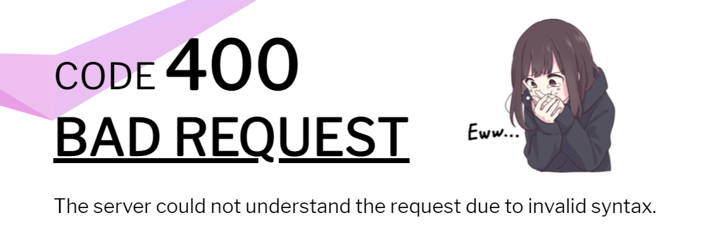
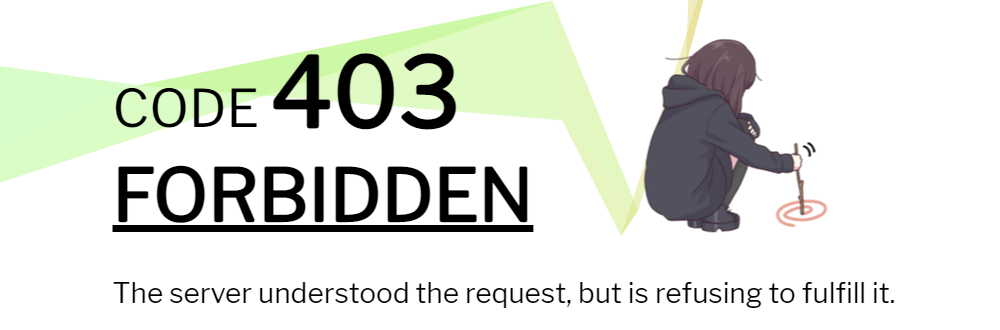
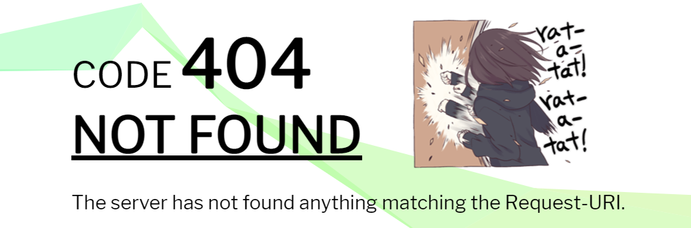
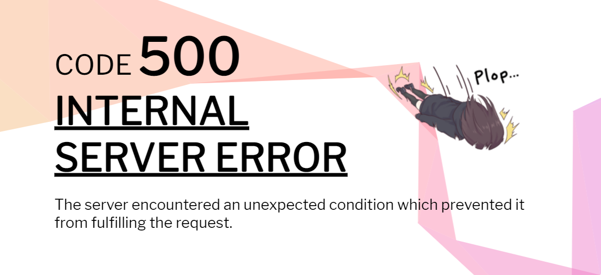
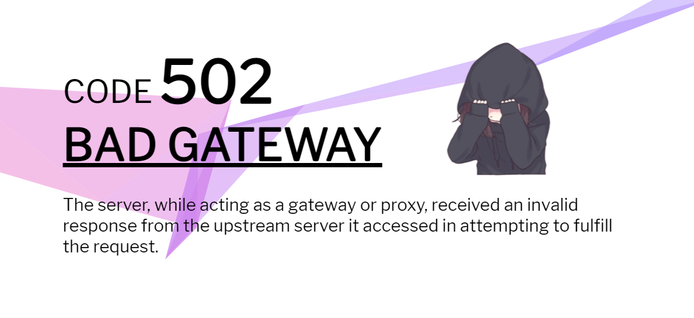

Custom error pages for common web server error codes featuring the [Menhera](https://github.com/a-wing/Menhera-chan) sticker pack and a [ribbon.js](https://github.com/kuriv/ribbon) background.

# Preview

Below is a preview of the provided error pages.
* **400 Bad Request**
  
* **401 Unauthorized**
  
* **403 Forbidden**
  
* **404 Not Found**
  
* **418 I'm a teapot**
  
* **500 Internal Server Error**
  
* **502 Bad Gateway**
  


# Installation

Clone the contents of the repo to the root folder of your favourite web server and configure it to serve error codes directly from the root.

# Configuring the webserver

## Configuring NGINX

Add the following in the relevant `server` or `location` block:

```conf
error_page 400 /400.html;
error_page 401 /401.html;
error_page 403 /403.html;
error_page 404 /404.html;
error_page 418 /418.html;
error_page 500 /500.html;
error_page 502 /502.html;
```

> If you would like to make use of my CDN (`cdn.dsme.cc`) instead, replace all occurences of `xxx.html` with `https://cdn.dsme.cc/menhera-error-pages/xxx.html`

## Configuring Traefik

Prepare a container running a webserver to serve the error pages and serve it under `your-domain.tld` or `your-ip`. Replace all relative links to resources in each .html file with their absolute counterparts including your domain or IP: this is readily achieved running a search and replace with the following settings:

# Dependencies and assets

The page makes use of [ribbon.js](https://github.com/hustcc/ribbon.js) for the coloured ribbon effect in the background, [FontAwesome](https://github.com/FortAwesome/Font-Awesome) for the GitHub icon and [Google Fonts](https://github.com/google/fonts) for the [Libre Franklin](https://fonts.google.com/specimen/Libre+Franklin) font.

The ribbon.min.js is slightly different than the one from the official repo, having an additional parameter 'colseed' acting as a seed for the initial colour of the ribbon. This allows to have a consistent, but different ribbon colour for each error page.

These dependencies, as well as other assets, are all included in the repo, but hardcoded to be served via a my personal CDN, `cdn.dsme.cc`. If you would like to use your own CDN instead, it is safe to search and replace all occurrences of `cdn.dsme.cc` with your CDN address in all `*.html` files in the root of the repo.

# License

This image is licensed under [GNU General Public License v3.0](https://www.gnu.org/licenses/gpl-3.0.en.html).

Some of the libraries included in this repository (e.g. [ribbon.js](https://github.com/hustcc/ribbon.js), [FontAwesome](https://github.com/FortAwesome/Font-Awesome), etc.) may be covered under a difference license.

Please remember it is your responsibility as the end-user to ensure that your use case complies with the licenses of all included software.